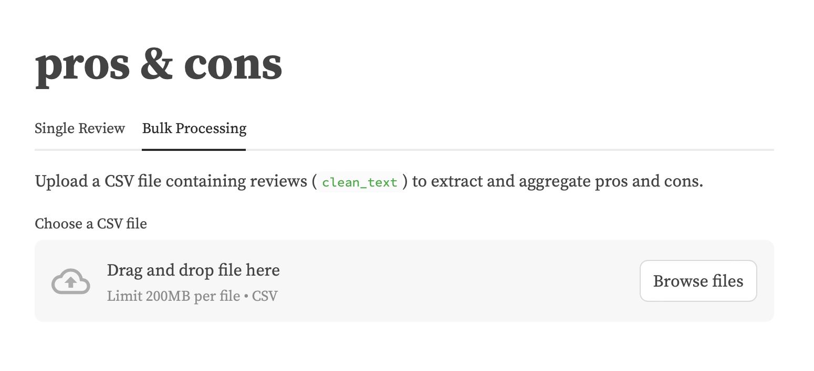

# Review Analysis and Generation with RuGPT-3 and RuT5

## Overview
This project focuses on leveraging **RuGPT-3** and **RuT5** to perform comprehensive review analysis and generation. The primary objective is to automate the creation of insightful and coherent synthetic text reviews, as well as to extract key aspects such as pros and cons from existing reviews. By fine-tuning these models on a curated dataset, we aim to enhance their ability to understand and generate contextually relevant content tailored to specific domains.


## Prototype

Experience the capabilities of our model through the live demo:

[Demo Stand](http://13.228.23.187:8502)



## Project Structure

```
├── data
│   ├── balanced.csv          # Cleaned and balanced dataset
│   ├── synthetic.csv         # Synthetic dataset
│   ├── test.csv              # Testing dataset
├── notebooks
│   ├── eda.ipynb             # Notebook for exploratory data analysis
│   ├── synthetic.ipynb       # Synthetic data generation process
├── streamlit
│   ├── app.py                # Streamlit UI for model interaction
│   ├── requirements.txt      # Required dependencies for Streamlit
├── model_gpt.ipynb           # Training notebook for the generation model
├── model_t5.ipynb            # Training notebook for the extraction model
├── README.md                 # Project documentation
```

## Data Sources

- **Geo Reviews Dataset 2023:**
  - [GitHub](https://github.com/yandex/geo-reviews-dataset-2023)
  - [HuggingFace](https://huggingface.co/datasets/d0rj/geo-reviews-dataset-2023/tree/main)


## Data Processing
The **eda.ipynb** notebook details:

**Data Cleaning:**
   - Removed emojis and special characters.
   - Standardized text formats.
   - Applied under-sampling techniques using `RandomUnderSampler` to balance class distributions.
   - Visualized frequent terms using word clouds.

## Model Training

### 1. **Review Generation Model**

 - This [model](https://drive.google.com/drive/folders/13YWZ_JbP59bTEcatS8H2cg0WG7QTQb35?usp=drive_link) is designed to generate human-like reviews given two key inputs: the category of the venue (e.g., "restaurant," "hotel") and the sentiment you want the review to convey (e.g., positive, negative, neutral). By conditioning on these factors, the model produces coherent and contextually appropriate reviews that mimic genuine customer feedback. 

### 2. **Aspect Extraction Model | T5**

 - This [model](https://drive.google.com/file/d/1USDfb9qCaYulWvxBg09oc1p2ODziG-tK/view?usp=sharing) focuses on identifying key aspects (e.g., pros and cons) mentioned in the review. By learning patterns in the data, it extracts and categorizes these aspects, making it easier to understand the strengths and weaknesses presented in the reviews.

ROUGE scores:

 

## Deployment

- The models and UI are hosted via **Streamlit**.

## Team

- **Eduard Antonov**: EDA, Synthetic Data, Fine-tuning.
- **Roman Penzov**: Production.
- **Konstantin Gridnev**: Model Training.
- **Alena Dragunskaya**: Analyst / Project Manager.
- **Yacub Kharabet**: Model Training.